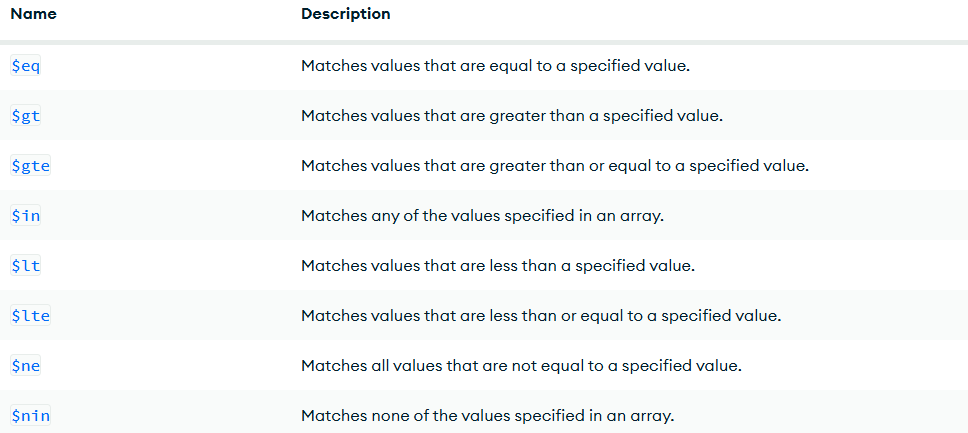
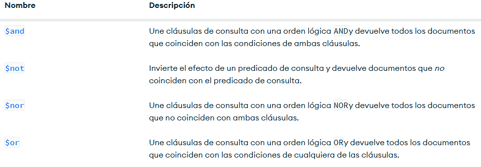

# Crud y Consultas en MongoDB

## Crear una Base de datos
Solo se crea si contiene por lo menos una coleccion

**use db1**


## Como crear una coleccion

use db1
db.createCollection("Empleado")


## Mostrar las colecciones
show collections

## Insertar un documento
```Json
db.Alumnos.insertOne(
{
    nombre: 'Soyla',
    apellido1: 'Vaca',
    edad: 32,
    ciudad: 'Cenderos'
}
)
```

## Insercion de un documento más complejo con arrays

```Json
bdejemplo> db.Alumnos.insertOne(
    {
      nombre: 'Kylian',
      apellido: 'Mbappe',
      apellido2: 'Lottin',
      edad: 26,
      aficiones: ['Fútbol', 'Travesaños', 'Real Madrid']
})
```

## Inserción de documentos más complejos con anidado y ID

```Json
bdejemplo> db.Alumnos.insertOne(
    {
      nombre: 'Aldair',
      apellido1: 'Andrade',
      apellido2: 'Rojo',
      edad: 19,
      estudios: ['TSU en Desarrollo de Software', 'Tecnico en Ciencia de Datos'],
      experiencia: {
                     lenguaje: 'Java',
                     sbd: 'SQL Server',
                     aniosExp: 7
                   }
})
```

```Json
bdejemplo> db.Alumnos.insertOne(
    {
      id: 3,
      nombre: 'Sergio',
      apellido: 'Ramos',
      equipo: 'Monterrey',
      aficiones: [ 'Dinero', 'Mujeres', 'Fútbol'],
      talentos: {
           futbol: true,
           ejercicio: true,
        }
    }
)
```

## Insertar Múltiples documentos

```Json
bdejemplo> db.Alumnos.insertMany(
   [
      {
         _id: 12,
         nombre: 'Roberto',
         apellido: 'Gomez',
         edad: 23,
         descripcion: "Es un comendiante buenp"
       },
       {
         nombre: 'Luis',
         apellido: 'Suarez',
         edad: "43",
         habilidades: [
                        'Correr', 'Morder', 'Malo'
                      ],
         direcciones: {
                        calles: 'Del Infierno',
                        numero: 66
                      },
         esposas: [
                     {
                        nombre: 'Marisol',
                        edad: 20,
                        pension: 350,
                        hijos: ['Pepsi', 'Bridget']
                      },
                      {
                        nombre: 'Dorien',
                        edad: 55,
                        pension: 6500.33,
                        complaciente: true
                      }
                   ]
         }
       ]
     )
```


# Practica1


## Cargar Datos
[lirbros.json](./data/libros.json)

## Búsquedas. Condiciones Simples de Igualdad. Método find()

1. Seleccionar todos los documentos de la colección "libros"

```Json
db.libros.find({})
```

2. Mostrar todos los documentos que sean de la editorial "Biblio"

```Json
db.libros.find({editorial:'Biblio'})
```

3. Mostrar todos los documentos que el precio sea 25

```Json
db.libros.find({precio:25})
```

4. Seleccionar todos los documentos donde el titulo sea JSON para todos 

```Json
db.libros.find({titulo:'JSON para todos'})
```

## Operadores de Compración

[Operadores de Comparación](https://www.mongodb.com/docs/manual/reference/operator/query/)




1. Mostrar todos los documentos donde el precio sea mayor a 25

```Json
db.libros.find({
       precio: {$gt:25}
    }
)
```

2. Mostrar los documentos donde el precio sea 25

```json
db.libros.find({ precio: { $eq: 25 } } )
```

3. Mostrar los documentos cuya cantidad sea menor a 5 

```json
db.libros.find({ cantidad: { $lt: 5} } )
```

4. Mostar los documentos que pertenezcan a la editorial Biblio o Planeta

```json
db.libros.find({ editorial: { $in: ['Biblio', 'Planeta']} } )
```

5. Mostrar todos los documentos de libros que cuesten 20 o 25

```json
db.libros.find({ precio: { $in: [20, 25]} } )
```

6. Mostrar todos los documentos de libros que no cuesten 20 o 25

```json
db.libros.find({ precio: { $nin: [20, 25]} } )
```

7. Mostrar el primer documentos de libros que cueste 20 o 25

```json
db.libros.findOne({ precio: { $in: [20, 25]} } )
```

## Operadores Lógicos

[Operadores de Lógicos](https://www.mongodb.com/docs/manual/reference/operator/query/)



### Operador AND

Dos posibles opciones de AND

1. La simple, mediante condiciones separadas por comas

**Sintaxis**

```json
db.collection.find({ condicion1, condicion2 } ) -> Con esto asume que es una and
```

2. Usando el operador $and

**Sintaxis**

```json
db.collection.find({$and[{condicion1}, {condicion2}]} ) -> Con esto asume que es una and
```


#### Ejercicios

1. Mostrar todos aquellos documentos que cuesten más de 25 y cuya cantidad sea inferior a 15

**Forma Simple**

```json
db.libros.find({ precio: { $gte: 25}, cantidad: {$lt: 15} } )
```

**Operador AND**

```json
db.libros.find({ $and:[ {precio: { $gte: 25}}, {cantidad: {$lt: 15}}] } )
```

2. Mostrar todos aquellos libros que cuesten más de 25 y cuya 
  cantidad sea inferior a 15 y id igual a 4

**Forma Simple**

```json
db.libros.find({ precio: { $gte: 25}, cantidad: {$lt: 15}, _id:4 } )
```

**Operador AND**

```json
db.libros.find({ $and:[ {precio: { $gt: 25}}, {cantidad: {$lt: 15}}, {_id:{$eq: 4}}] } )
```

### Operadores OR

1. Mostrar todos aquellos libros que cuesten mas de 25 o cuya cantidad sea inferior a 15

```json
db.libros.find( { 
  $or: [ 
    { precio: { $gt: 25 } }, 
    { cantidad: { $lt: 15 } } 
    ] 
  })
```

### AND y OR Combinados

1. Mostrar los libros de la editorial Biblio con precio mayor a 30 o libros de la editorial
  Planeta con precio mayor a 20

```json
db.libros.find( { 
  $or: [ 
    { $and:[{editorial: 'Biblio'}, {precio: {$gt:30}}] }, 
    { $and: [{editorial: {$eq:'Planeta'}}, {precio: {$gt:20}}] } 
    ] 
  })
```

### Forma Simple

```json
db.libros.find( 
      {
      $or: [ 
        {editorial:'Biblio',precio:{ $gt:30}},
        {editorial:{$eq:'Planeta'},precio:{$gt:20}}
      ]
    })
```

## Proyección de Columnas

*** Sintaxis ***

db.collection.find(filtro, columnas)

db.libros.find({},{titulo:1})

1. Seleccionar todos los documentos, mostrando el titulo y la editorial

```json
db.libros.find({}, {titulo:1, editorial:1})

db.libros.find({}, {titulo:1, editorial:1, _id:0})
```

2. Seleccionar todos los documentos de la editorial Planeta, 
  mostrando solamente el titulo y la editorial

```json
db.libros.find({editorial: 'Planeta'}, {titulo:1, editorial:1, _id:0})
```


## Operador Exists (Permite saber si un campo se encuentra o no en un documento)

```json
db.libros.find(
  { editorial: {$exists:true} }
  )
```

```json
db.libros.insertOne({
  _id:10,
  titulo: 'Mongo en entornos graficos',
  editorial: 'Terra',
  precio: 125
  }
)
```

1. Mostrar todos lo documentos que no contengan el campo cantidad

```json
db.libros.find(
  { cantidad: {$exists:false} }
  )
```


## Operador Type (Permite preguntar si un determinado campo corresponde con un tipo)

[Operador Type](https://www.mongodb.com/docs/manual/reference/operator/query/type/#mongodb-query-op.-type)

1. Mostrar todos los documentos donde el precio sean doubles

```json
db.libros.find(
  { precio: {$type:1} }
  )
```

```json
db.libros.find(
  { precio: {$type:16} }
  )
```

```json
db.libros.insertOne({
  _id:11,
  titulo: 'IA',
  editorial: 'Terra',
  precio: 125.4,
  cantidad:20
  }
)
```

```json
db.libros.find( { precio: { $type: 1 } }, {_id:0, cantidad:0} )
```


```json
db.libros.insertMany([
 {
    _id: 12,
    titulo: 'IA',
    editorial: 'Terra',
    precio: 125, 
	cantidad: 20
  },
  {
    _id: 13,
    titulo: 'Python para todos',
    editorial: 2001,
    precio: 200, 
	cantidad: 30
  }]
  )
```

1. Seleccionar los documentos donde el precio sea de tipo entero

```json
db.libros.find( {editorial: {$type:16}})
db.libros.find( {editorial: {$type:'int'}})
```

2. Seleccionar todos los documentos donde la editorial se String

```json
db.libros.find( {editorial: {$type:2}})
db.libros.find( {editorial: {$type:'String'}})
```

## Practica de consultas
1. Instalar las Tools de MongoDB
[DatabaseTools](https://www.mongodb.com/try/download/database-tools)


2. Cargar el Json Empleados (Debemos estar ubicados en la carpeta donde se encuentra el json empleados)

- En local:
    Comando:
      mongoimport --db curso --collection empleados --file empleados.json

- Docker:
    comando:
      mongoimport --port 80 --db curso --collection empleados --file empleados.json

# Modificando Documentos
## Comandos importantes

1. UpdateOne -> Modificar un solo documento
2. UpdateMany -> Modificar multiples documentos
3. ReplaceOne -> Sustituir el contenido completo de un documento

```json
db.collection.updateOne(
  {filtro},
  {operador: }
)
```

[Operador Update](https://www.mongodb.com/docs/manual/reference/operator/update/)

### Operador set 

1. Modificar un documento

```json
db.collection.updateOne({})

db.libros.updateOne({titulo: 'Pyton para todos'}, {$set:{titulo:'Java para Todos'}})
```


2. Actualizar el precio a 100 y la cantidad a 50 para el id: 10

```json
db.libros.updateOne({_id:10}, {$set:{precio:100, cantidad:50}})
```

#### Modificar Multiples Documentos

-- Modificar todos los ducumentos  sea mayor a 100 a un precio de 150

```json
db.libros.updateMany(
  {precio:{$gt:100}},
  {$set:{precio:150}}
)
```

2. Operador $inc y $mul

-Actualizar con un incremento de 5 todos los elementos

```json
db.libros.updateMany(
  {},
  {$inc:{precio:5}}
)
```

-Actualizar con multiplicación de 2 todos los que la cantidad
sean mayores a 20

```json
db.libros.updateMany({cantidad:{$gt:20}},{$mul:{cantidad:2}})
```

--Actualizar todos los documentos donde el precio sea mayor a 20 y
-- se multiplique por 2 la cantidad y el precio 

```json
db.libros.updateMany(
  {precio:{$gt:20}},
  {$mul:{cantidad:2, precio:2}}
)
```


3. Reemplazar Documentos {ReplaceOne}

```Json
db.libros.replaceOne({_id:2}, 
    {
      titulo:'Cartas a Milena', 
      autor: 'Franz Kafka',
      precio: 500
    }
)
```

# Borrar Documentos

1. deleteOne -> Elimina un solo documento
2. deleteMany -> Elimina Multiples Documentos

1. Eliminar el documento con id 2 

```json
db.libros.deleteOne({_id:2})
```

2. Eliminar los documentos donde la cantidad sea mayor o igual a 150

```json
db.libros.deleteOne(
  {cantidad:{$gte:150}}
)
```

```json
db.libros.deleteMany(
  {cantidad:{$gte:100}}
)
```

# Expresiones Regulares

1. Buscar los libros que contengan el titulo la letra "t"

```json
db.libros.find({titulo:/t/})
```

2. Buscar los libros que en el titulo contengan la palabra Json

```json
db.libros.find({titulo:/Json/})
```

3. Buscar todos los documentos que en el titulo terminen en tos 

```json
db.libros.find({titulo:/tos$/})
```

4. Todos los documentos que en el titulo comiencen con Java

```json
db.libros.find({titulo:/^J/})
```

# Operador $regex

[Operador Regex](https://www.mongodb.com/docs/manual/reference/operator/query/regex/)

-- Seleccionar los libros que contengan la palabra para en el titulo

```json
db.libros.find({titulo:{$regex: 'para'}})
```

```json
db.libros.find({titulo:{$regex: 'JSON'}})
```

```json
db.libros.find({titulo:{$regex: /JSON/}})
```

- Distinguir entre mayusculad y minusculas 

```json
db.libros.find({titulo:{$regex: /json/}}) -> No distingue entre mayusculas y minusculas 
```

- Distinguir entre mayusculad y minusculas 

```json
db.libros.find({titulo:{$regex: /json/, $options:'i'}}) 

db.libros.find({titulo:{$regex: /json/i}}) 
```


-- Seleccionar todos los libros que comiencen con j o J

```json
db.libros.find({titulo:{$regex:/^j/i}})
```

-- Seleccionar todos los libros que terminen con es

```json
db.libros.find({titulo:{$regex:/es$/i}})
```

# Metodos sort (Ordenar Documentos)

1. Ordenar los libros de manera ascendente por el precio 

```json
db.libros.find({}, {titulo:1, precio:1, _id:0}).sort({precio:1})
```

2. Ordenar los libros de manera descendente por el precio 

```json
db.libros.find({}, {titulo:1, precio:1, _id:0}).sort({precio:-1})
```

3. Ordenar los libros de manera ascendente por la editorial y de manera descendente
por el precio, mostrando el titulo, precio, editorial

```json
db.libros.find({}, {titulo:1, precio:1, _id:0, editorial:1}).sort({editorial:1, precio:-1})
```

# Otros Métodos  skip, limit, size 

```json
db.libros.find({}).size()
```

```json
db.libros.find({titulo:{$regex:/Java/i}}).size()
```

-- Buscar todos los libros pero mostrando los dos primeros

```json
db.libros.find({}, {titulo:1, editorial:1, precio:1, _id:0}).limit(2)
```
-- Mostar los 3 ultimos libros

```json
db.libros.find({}, {titulo:1, editorial:1, precio:1, _id:0}).sort({precio:-1}).limit(3)
```

-- Seleccionar todos los libros oredenados por titulo de forma descendente
saltando los dos primeros documentos y mostrando el tamaño

```json
db.libros.find({}).sort({titulo:-1}).skip(2).size()
```

# Borrar Colecciones y Bases de Datos

```json
use db5

db.createCollection('ejemplo')

show collection

db.ejemplo.insertOne({ 
  nombre: 'Cghapuin'
  }
)
```

- Eliminar coleccion

```json
db.ejemplo.drop()
```

- Eliminar base de datos

```json
db.dropDatabase()
```

